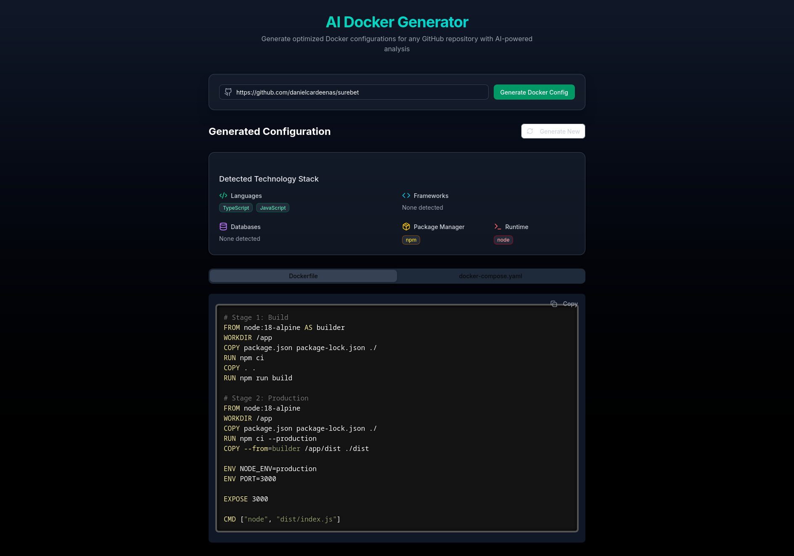

# DockerComposeAIGenerator

DockerComposeAIGenerator is an AI-powered tool that automatically generates Dockerfile and docker-compose.yaml files for any GitHub repository, making containerization and deployment quick and easy.

## Demo

A public demo version is available at: [https://dockergen.jonte.au](https://dockergen.jonte.au)

**Important Notes about the Demo:**
- You must provide your own OpenAI API key to use the demo version
- Unlike the main version where the API key is defined in a server-side .env file, the demo requires users to input their key in the web interface
- The demo is based on the [`demo-version`](https://github.com/jontstaz/DockerComposeAIGenerator/tree/demo-version) branch

## Overview

This project takes a GitHub repository URL as input, analyzes its structure and content, and uses an AI model to generate appropriate Docker configuration files tailored to that specific project. It's perfect for developers who want to quickly containerize and deploy projects without spending time manually crafting Docker configurations.

## Screenshot


*AI Docker Generator WebUI showing generated Docker configurations for a GitHub repository*

## Features

- **One-Click Generation**: Simply provide a GitHub URL and get ready-to-use Docker configurations
- **Intelligent Analysis**: Automatically identifies programming languages, frameworks, databases, and dependencies
- **Production-Ready Outputs**: Generates optimized multi-stage Dockerfiles when beneficial
- **Smart Defaults**: Includes sensible default configurations for environment variables, volumes, and networking
- **Multiple AI Providers**: Choose between OpenAI API or your local Ollama installation

## Architecture

The project consists of two main components:

1. **API Backend** (Python/FastAPI):
   - Processes GitHub repositories using Repomix
   - Communicates with OpenAI or Ollama models
   - Generates and returns Docker configurations

2. **Web Frontend** (Next.js):
   - Provides user interface for entering GitHub URLs
   - Allows selection between OpenAI or Ollama as the AI provider
   - Displays generated Docker configurations
   - Allows copying or downloading of configuration files

## Requirements

- Python 3.9+
- Node.js 18+
- OpenAI API key (if using OpenAI as provider)
- [Ollama](https://ollama.ai) installation (if using Ollama as provider)

## Installation

1. Clone this repository:
   ```bash
   git clone https://github.com/jontstaz/DockerComposeAIGenerator.git
   cd DockerComposeAIGenerator
   ```

2. Set up the API:
   ```bash
   cd api
   # Create a virtual environment (optional but recommended)
   python -m venv venv
   source venv/bin/activate  # On Windows: venv\Scripts\activate
   
   # Install dependencies
   pip install -r requirements.txt
   
   # Create a .env file with your OpenAI API key (only needed if using OpenAI)
   echo "OPENAI_API_KEY=your_api_key_here" > .env
   ```

3. Set up the web frontend:
   ```bash
   cd ../web
   npm install
   # or if you use bun
   bun install
   ```

## Usage

1. Start the API server:
   ```bash
   cd api
   uvicorn main:app --reload
   ```

2. Start the web frontend:
   ```bash
   cd web
   npm run dev
   # or if you use bun
   bun run dev
   ```

3. Open your browser and navigate to http://localhost:3000

4. Enter a GitHub repository URL, select your preferred AI provider (OpenAI or Ollama), and click "Generate"
   - If using Ollama, make sure you have it running locally and have pulled your preferred model

5. Review the generated Dockerfiles and docker-compose.yaml

6. Copy or download the configuration files and use them in your project

## Docker Deployment

You can easily deploy this application using Docker:

1. Copy the example environment file and set your OpenAI API key (if using OpenAI):
   ```bash
   cp .env-example .env
   # Edit .env with your actual API key
   ```

2. Build and start the containers:
   ```bash
   docker-compose up -d
   ```

3. Access the application at http://localhost:3000

4. To stop the containers:
   ```bash
   docker-compose down
   ```

## How It Works

1. The tool fetches and analyzes the GitHub repository using Repomix, which creates a semantic map of the project's structure and content
2. This map is used as context for an AI model (OpenAI's GPT or a local Ollama model) that identifies the technologies used and the requirements for containerization
3. The AI generates appropriate Docker configuration files based on the project's specific needs
4. The generated files are presented to the user through the web interface

## License

[MIT License](LICENSE)

## Contributing

Contributions are welcome! Please feel free to submit a Pull Request.

1. Fork the repository
2. Create your feature branch (`git checkout -b feature/amazing-feature`)
3. Commit your changes (`git commit -m 'Add some amazing feature'`)
4. Push to the branch (`git push origin feature/amazing-feature`)
5. Open a Pull Request